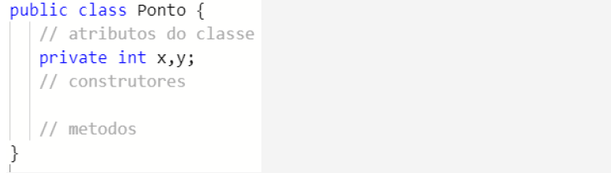

<h1>Individual Textual Production - Object Oriented Programming</h1>
<h2>Theme - Applying the concepts of Object Oriented Programming</h2>
<h2>Base text:</h2>
Suppose we have to develop a computer graphics system and we want to start by modeling an (x,y) coordinate, that is, a point on the computer screen. As we are object-oriented programming with the Java language, the “points” of the computer graphics system must be represented by a class, the information that the class needs to store is the x and y coordinates of a “point” on the screen, so x and y will be integer attributes and private of the Ponto class. Furthermore, so that our “point” can be functional, we will need to have constructors for the Point class and methods to represent actions and interactions that we can with objects of the Point class. For example, it would be interesting to have a method that checks if two points have the same values ​​for x and y, that is, the points are equal and a method that calculates the distance between two points. See below how the Ponto class would look without the constructors and methods:

<h2>statement:</h2>
Considering your knowledge, the above explanations and the Ponto class presented, write the implementations of the Ponto class constructors and methods:  A) Implement the constructor of the point class that takes as parameters two integer values ​​with the values ​​of attributes x and y respectively. Implement another constructor for the Ponto class that does not receive anything as a parameter, the constructor initializes the class attributes (x and y) with the value zero. Note that here we use static polymorphisms.  B) Implement a method that checks if two points are equal, that is, check if two points have the same values ​​for x and y, one of the points will be passed implicitly in the method call and the other in a traditional way as a parameter of the method. Then, implement the method that calculates the distance between two points, so the object that invokes the method is considered a parameter (implicit) and another Point object is passed as a parameter to the method (explicit).  If you don't remember how to calculate the distance between two points, you can consult the explanations on the website: https://www.educamaisbrasil.com.br/enem/matematica/distancia-entre-dois-pontos